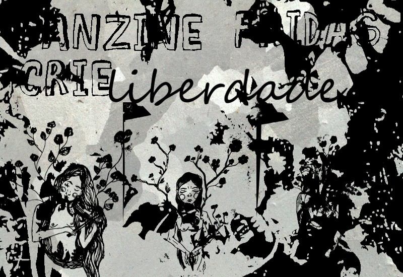

# Fridas

**Leia** instruções.txt
 
**Leia** texto arte e tecnologia.txt 

> Programa desenvolvido com referência ao código https://www.openprocessing.org/sketch/179479, encontrado no site openprocessig.

> Programa criado no software Processing, com artes de Lelê Lótus, Eufeminismo – GulianLin, Polly, Amanda Soriano, Dilua, Andressa Costa, AnaCoruja, Mari Brandão.

# Programa Inicial

# Programa em execução

# Algumas artes exportadas

