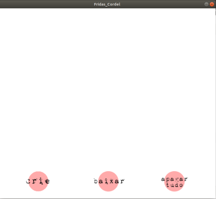
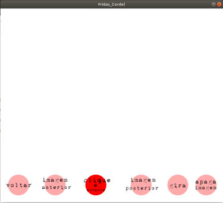
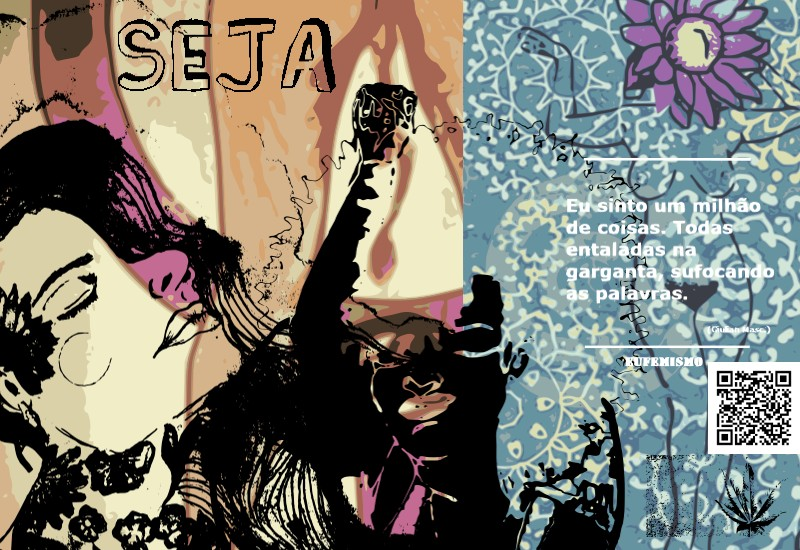
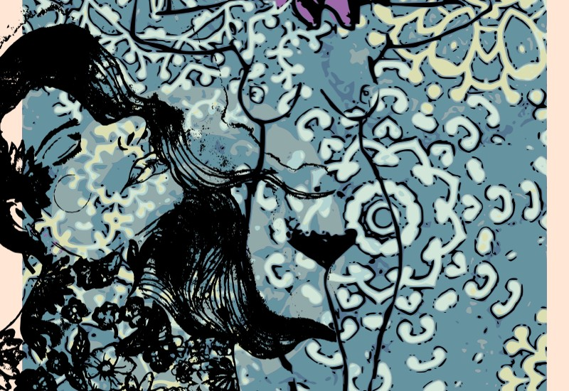

# Fridas

## Descrição 

O trabalho Fridas é feito para as matérias de Arte e Tecnologia e Artimedia III, pela Universidade Federal do Recôncavo da Bahia, consiste numa experiência de arte e tecnologia com intuito de uma troca de informações offline.

O nome “Fridas” tem como referência a artista mexicana Frida Kahlo, utilizada como base para a temática arte e mulher, o objetivo é utilizar de mecanismos tecnológicos sem a utilização de internet para compartilhar e instigar a troca de informações, ao mesmo tempo que questiona a presença de mulheres no cenário artístico.
A parte tecnológica terá como suporte o dead drop, criado pelo artista digital Aram Bartholl em 2010, o nome vem do método ''dead drop'' de comunicação da espionagem. Os aparelhos podem ser considerados como uma rede P2P anônima e offline.
Para o dead drop será utilizado um drive USB imbutido na parede, dentro do pendrive terá os arquivos deaddrops-manifesto.txt, arquivo readme.txt e outros com o conteúdo do projeto (programas, as instruções de como utilizar e pasta de artigos sobre o tema).

O conteúdo apresentado dentro do dead drop será um arquivo executável feito no processing.

**Leia** instruções.txt

**Leia** texto arte e tecnologia.txt 

> Esse trabalho consiste em um Programa desenvolvido com referência ao código https://www.openprocessing.org/sketch/179479, encontrado no site openprocessig.

> Programa criado no software Processing, com artes de Lelê Lótus, Eufeminismo – GulianLin, Polly, Amanda Soriano, Dilua, Andressa Costa, AnaCoruja, Mari Brandão.

# Programa Inicial

# Programa em execução

# Algumas das artes exportadas

> Para ver mais artes exportadas vá em:

(Crie sua Arte/Crie sua arte/Fridas_02/export/)
